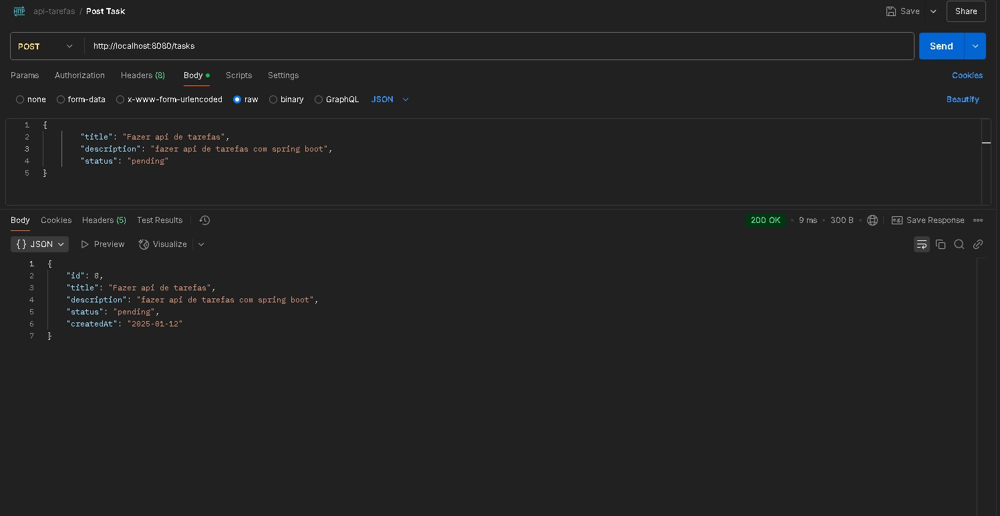
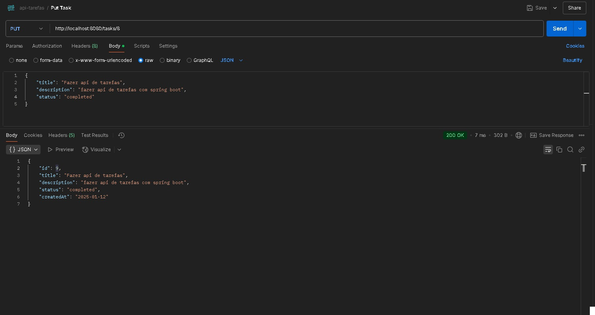
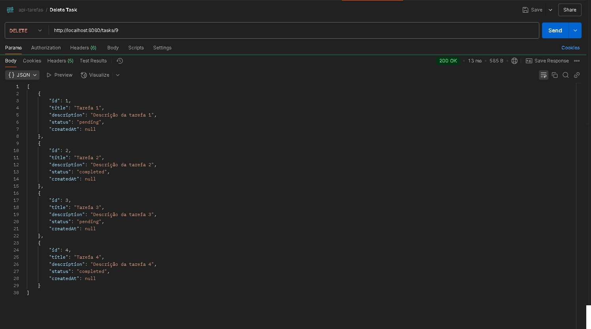
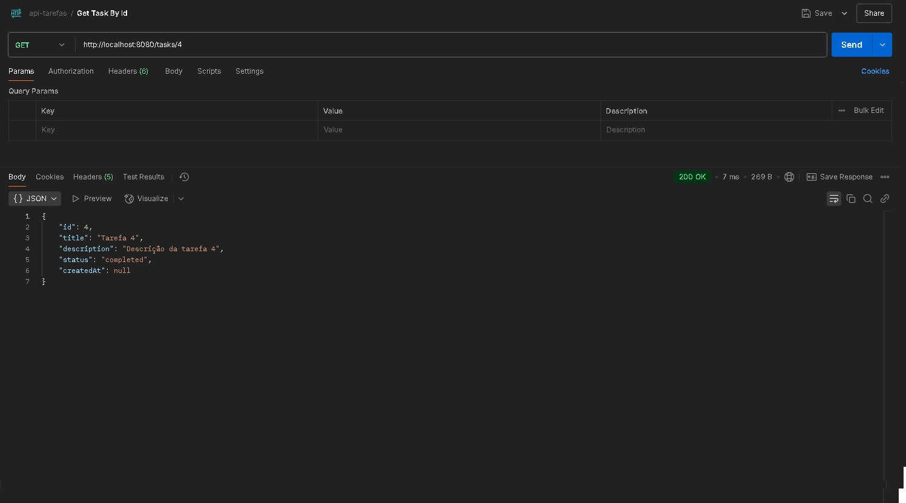

# API REST de Gerenciamento de Tarefas

Este projeto consiste em uma API RESTful desenvolvida com Spring Boot, Java, JPA (Hibernate), e H2 Database para gerenciamento de tarefas. A aplicação permite realizar operações de CRUD (Create, Read, Update, Delete) para tarefas. As tarefas possuem título, descrição, status (pendente ou concluída) e a data de criação.

## Funcionalidades

- **Cadastrar tarefas**: Criar novas tarefas com título, descrição, status e data de criação automática.
- **Listar todas as tarefas**: Retorna todas as tarefas cadastradas no sistema.
- **Buscar tarefa por ID**: Retorna uma tarefa específica com base no seu identificador.
- **Atualizar tarefa**: Altera o título, descrição ou status de uma tarefa.
- **Deletar tarefa**: Exclui uma tarefa do sistema.

## Tecnologias Utilizadas

- **Spring Boot**: Framework para desenvolvimento rápido de aplicações Java.
- **JPA (Hibernate)**: ORM (Mapeamento Objeto-Relacional) utilizado para comunicação com o banco de dados.
- **H2 Database**: Banco de dados em memória, utilizado para armazenar as tarefas.
- **Postman**: Utilizado para testar a API durante o desenvolvimento.

## Pré-requisitos

- **Java 17+**
- **Maven**
- **Spring Boot** 3.x

## Como Rodar o Projeto

### 1. Clone o repositório

```bash
git clone https://github.com/seu-usuario/https://github.com/ericktnunes/API-REST-de-Gerenciamento-de-Tarefas.git
cd API-REST-de-Gerenciamento-de-Tarefas
```

### 2. Rodar o projeto pela classe ApiTarefasAplication

A api poderá ser acessada pela em [localhost:8080](http://localhost:8080)

## Api EndPoints
Para fazer requisições HTTP foi usado a ferramenta <a href="https://www.postman.com" target="_blank">Postman</a>:
- **Criar Tarefa** <br>


- **Atualizar tarefa** <br>


- **Deletar tarefa**<br>


- **Listar todas tarefas**<br>
[Texto alternativo](images-repositories/getAllTasks.jpg)

- **Listar tarefas pelo seu id**<br>



